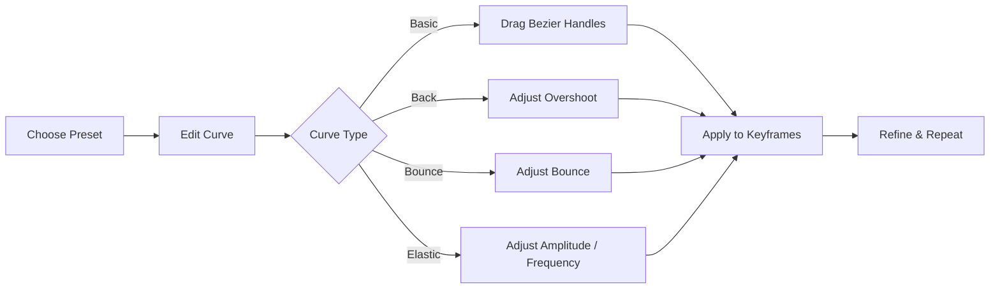

<div align="center">

# ⚡ Zelf-Xtens

### A focused animation & workflow panel for Adobe After Effects

**Shape your motion. Align your layers. Build faster.**

[](https://github.com/zelfyn/Zelf-Xtens)
[](https://www.adobe.com/products/aftereffects.html)
[](https://github.com/Adobe-CEP/CEP-Resources)
[](https://github.com/zelfyn/Zelf-Xtens)

<p>
  <a href="#-why-zelf-xtens">Why Zelf-Xtens</a> •
  <a href="#-features">Features</a> •
  <a href="#-installation">Installation</a> •
  <a href="#-workflow">Workflow</a> •
  <a href="#-latest-updates">Updates</a>
</p>

</div>

---

## ✦ Why Zelf-Xtens?

After Effects gives you the tools. **Zelf-Xtens turns common animation and layer operations into a compact, direct workflow.**

Instead of jumping between menus, dialogs and repetitive steps, Zelf-Xtens puts curve editing, easing presets, anchor/position controls and everyday layer utilities into one focused panel.

> **Less hunting. More shaping. More motion.**

---

## 🚀 Features

<table>
<tr>
<td width="50%" valign="top">

### 📈 GRAPH

Design motion visually instead of guessing values.

- Interactive square curve editor
- Drag-to-edit Bezier handles
- **Normal / Overshoot** editing modes
- Live sliders that stay synchronized with graph handles
- Preview the curve directly in the panel
- Adjustable **Keys** for sampled animation
- Adjustable **Steps** for Step easing
- Save and reuse custom curves
- Searchable preset library

</td>
<td width="50%" valign="top">

### 🎛️ EASING PRESETS

Start fast, then fine-tune.

**BASIC**
- Standard
- Smooth
- Circ
- Sine
- Expo

**BACK**
- Overshoot
- Back
- Back In / Out / In Out

**BOUNCE**
- Bounce
- Bounce In / Out / In Out

**ELASTIC**
- Elastic
- Elastic In / Out / In Out

**CUSTOM**
- Your saved curves

</td>
</tr>
<tr>
<td valign="top">

### 🎯 ANCHOR / POSITION

A single 3×3 grid for quick alignment.

- Top / Center / Bottom
- Left / Right combinations
- Anchor Point mode
- Position mode
- Keep layer in place compensation
- Works with single or multiple selected layers
- Position alignment also supports Camera and Light

</td>
<td valign="top">

### 🧰 QUICK ACTIONS

Small actions that save real production time.

- Create Comp
- Null Parent
- Adjustment Layer
- Light
- Camera
- Precomp
- Create Solid
- Create Center Text
- Previous / Next Marker
- Stair / Sequence layer timing

</td>
</tr>
</table>

---

## 🧠 Graph Editor — Built for Hands-On Motion

Zelf-Xtens is designed around a simple idea: **the curve should tell you what the animation will do.**



### 🎚️ Direct manipulation

For **Back, Bounce and Elastic** families, the graph exposes draggable handles directly on the curve. The associated sliders remain synchronized, so you can work visually or numerically without the two states drifting apart.

### ↕️ Normal vs Overshoot

Basic curves can be edited in two modes:

| Mode | Behaviour |
|---|---|
| **Normal** | Handles stay between 0% and 100% |
| **Overshoot** | Handles can move beyond 0% / 100% for curves that intentionally exceed the target value |

---

## 🎨 Preset Library at a Glance

| Category | Presets / Families |
|---|---|
| **BASIC** | Linear, Ease In, Ease Out, Ease In Out, Step, Smooth, Soft Ease, Strong Ease, Smooth Step, Circ, Sine, Expo + variants |
| **BACK** | Overshoot, Back, Back In, Back Out, Back In Out |
| **BOUNCE** | Bounce, Bounce In, Bounce Out, Bounce In Out |
| **ELASTIC** | Elastic, Elastic In, Elastic Out, Elastic In Out |
| **CUSTOM** | Saved user-made curves |

> Tip: use the preset search field when you already know the motion you want. Then shape the result instead of building it from zero.

---

## 🎯 Anchor / Position in One Grid

The **ANCHOR / POSITION** section combines two jobs that are often repeated throughout a motion project.

```text
┌───────────┬───────────┬───────────┐
│ ↖ Top     │ ↑ Top     │ ↗ Top     │
├───────────┼───────────┼───────────┤
│ ← Left    │ • Center  │ → Right   │
├───────────┼───────────┼───────────┤
│ ↙ Bottom  │ ↓ Bottom  │ ↘ Bottom  │
└───────────┴───────────┴───────────┘
```

**Anchor Point mode** moves the anchor and can compensate Position so the artwork stays visually in place.

**Position mode** aligns the selected layer to the composition, or aligns multiple selected layers using their combined bounds.

---

## 🧰 SHORTCUTS — The Everyday Toolkit

The **SHORTCUTS** tab groups practical After Effects operations into one place.

### Quick Actions

| Action | Purpose |
|---|---|
| `Create Comp` | Create a comp from selected footage or active comp settings |
| `Null Parent` | Create a null and parent selected layers / camera |
| `Adjustment Layer` | Create a comp-sized adjustment layer |
| `Light` | Create a point light |
| `Camera` | Create a centered 50mm camera |
| `Precomp` | Precompose selected layers and move attributes |
| `Create Solid` | Create a comp-sized solid using the chosen colour |
| `Create Center Text` | Create a centered text layer with chosen text and colour |

### Marker & Timing Tools

- **Previous Marker** / **Next Marker** — jump through markers without manually scanning the timeline.
- **Stair** — offset each selected layer in time.
- **Sequence** — arrange layers end-to-end with an adjustable gap.
- Choose direction and layer order before applying.

---

## 🌈 Custom Colour Picker

The built-in colour controls are designed to stay inside the workflow instead of opening the native picker every time.

- Saturation / Brightness control
- Hue slider
- HEX input
- RGB inputs
- 24 predefined swatches
- Recent colours
- OK / Cancel / Esc support

Use it for **Solid** and **Center Text** creation.

---

## ⚙️ Workflow

```text
SELECT
   ↓
CHOOSE
   ↓
SHAPE
   ↓
APPLY
   ↓
REFINE
```

### A typical animation pass

**1. Select your keyframes**  
Start with the property you want to shape.

**2. Pick an easing family**  
Use Basic for clean motion, Back for overshoot, Bounce for rebounds, or Elastic for spring-like motion.

**3. Shape the curve**  
Drag the handles or use the matching controls.

**4. Apply and iterate**  
Make another adjustment without leaving the panel.

> Every action is designed as a single After Effects **Undo** step, making experimentation easy to reverse.

---

## 📦 Installation

Zelf-Xtens is an Adobe **CEP panel**. The repository manifest declares After Effects host compatibility from **17.0 onward**, which corresponds to the After Effects 2020 generation and newer versions in the declared range.

### Windows

1. Download or clone this repository.
2. Copy the `Zelf-Xtens` folder into your Adobe CEP `extensions` directory.
3. Restart After Effects.
4. Open the panel from **Window → Extensions → Zelf-Xtens**.

Typical CEP extension location:

```text
C:\Program Files (x86)\Common Files\Adobe\CEP\extensions\
```

### macOS

Copy the extension folder into your CEP `extensions` directory, restart After Effects, then open it from **Window → Extensions → Zelf-Xtens**.

> For development / unsigned extension workflows, CEP debug settings may be required depending on your After Effects / CEP runtime configuration.

---

## 🧩 Project Structure

```text
Zelf-Xtens/
├── CSXS/
│   └── manifest.xml
├── assets/
│   └── icons/
├── css/
├── js/
│   ├── app.js
│   ├── bridge.js
│   ├── graph-presets.js
│   ├── graph.js
│   ├── anchor-position.js
│   ├── shortcuts.js
│   └── ui.js
├── jsx/
├── tests/
├── index.html
└── CHANGELOG.md
```

### Architecture at a glance

`UI` → `Bridge` → `ExtendScript` → `After Effects`

The front-end communicates with After Effects through a dedicated bridge, while the easing engine is kept as a separate module so curve logic can be reused and tested independently.

---

## 🔍 Design Principles

| Principle | What it means in Zelf-Xtens |
|---|---|
| **Visual first** | Curves and controls show what the animation is doing |
| **Fast interaction** | Small, focused controls instead of nested dialogs |
| **Synchronized controls** | Graph handles and sliders represent the same state |
| **Non-destructive workflow** | Actions map cleanly to After Effects Undo |
| **Persistent workflow** | UI state and custom presets can be remembered between sessions |
| **No unnecessary dependencies** | The panel UI is built from lightweight native browser APIs |

---

## 🗂️ Latest Updates

### `v1.3.3`

- Added **Normal / Overshoot** switch to the Curve header.
- Overshoot mode allows Basic Bezier handles to move outside the 0–100% range.
- Saved curves that already overshoot can reopen in Overshoot mode.
- The selected graph mode is remembered.

### `v1.3.2`

- Added adjustable **Step** preset with a **2–40 Steps** slider.
- Expanded the graph editor to use more of the available panel area.
- Refined buttons, tabs, category controls and preset tiles.
- Compact colour fields and a smaller colour picker UI.

See the full history in [`CHANGELOG.md`](CHANGELOG.md).

---

## 🧪 Development Notes

Zelf-Xtens uses a lightweight browser-based panel UI and ExtendScript bridge architecture. The easing engine supports native cubic-bezier motion as well as sampled curves for effects such as Bounce, Elastic, Back and Step.

The repository also contains a `tests/` directory for project-side testing.

---

## 🤝 Contributing

Found a bug? Have a better easing workflow? Want to improve the UI?

Open an issue or pull request in the repository:

**https://github.com/zelfyn/Zelf-Xtens**

When reporting a bug, include:

- After Effects version
- Zelf-Xtens version
- Selected feature / preset
- Steps to reproduce
- Screenshot or screen recording when useful

---

## 📌 Project Status

**Current version:** `1.3.3`

Zelf-Xtens is currently focused on two core tabs:

`GRAPH` · `SHORTCUTS`

The former Expressions workflow was removed in `v1.1.1`, while graph, anchor/position and shortcut tooling continue as the core experience.

---

<div align="center">

### ⚡ Shape the curve. Control the layer. Keep moving.

**[View Repository](https://github.com/zelfyn/Zelf-Xtens)** · **[View Changelog](CHANGELOG.md)**

Made for Adobe After Effects · Built by Claude AI and [Zelfyn](https://github.com/zelfyn)

</div>
